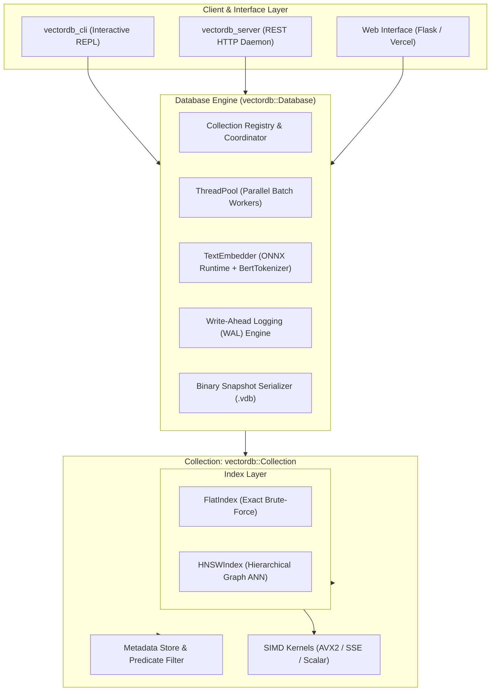

# ⚡ VectorDB: High-Performance Vector Database in C++

[](https://en.cppreference.com/w/cpp/17)
[](https://github.com/ParasRana123/vector_database)
[](https://github.com/ParasRana123/vector_database)
[](https://github.com/ParasRana123/vector_database)
[](https://huggingface.co/sentence-transformers/all-MiniLM-L6-v2)
[](LICENSE)

A high-performance, modular vector database engineered from scratch in modern **C++17**. VectorDB provides sub-millisecond vector similarity search, hierarchical graph indexing (HNSW), exact brute-force search (Flat), structured metadata predicate filtering, append-only Write-Ahead Logging (WAL), snapshot persistence, an embedded ONNX text embedding pipeline, an interactive REPL CLI, and a cross-platform REST HTTP daemon.

---

## 🚀 Key Features

* **⚡ SIMD-Accelerated Distance Metrics**:
  * Hardware-accelerated with **AVX2** and **SSE** intrinsics with auto-vectorized fallback routines.
  * Supported distance metrics: **Cosine Similarity**, **Euclidean (L2) Distance**, and **Dot Product (Inner Product)**.
* **🌲 Pluggable Index Architecture**:
  * **Flat Index**: Exact brute-force search with priority queue top-$K$ heap selection ($O(N)$).
  * **HNSW Index**: Multi-layer skip-graph Approximate Nearest Neighbor (ANN) index with heuristic neighbor pruning, greedy upper-layer routing, and beam search at layer 0 (achieving **>91.6% Recall@10** at **~430 μs** latency).
* **🏷️ Structured Metadata Engine & Predicate Filtering**:
  * Supports dynamic strongly-typed variants (`string`, `int64_t`, `double`, `bool`) and JSON serialization.
  * Single-pass filtering during index traversal: `$eq`, `$ne`, `$gt`, `$gte`, `$lt`, `$lte`, `$in`, `$all_of` (AND), `$any_of` (OR), and `$not`.
* **💾 Durability & Persistence**:
  * **Write-Ahead Logging (WAL)**: Append-only binary log recording mutations with instant crash recovery on startup.
  * **Binary Snapshot Serializer (`.vdb`)**: Fast zero-copy binary snapshot serialization with magic headers and version verification.
* **🧠 Embedded Text Embeddings & Zero-Dependency Tokenizer**:
  * Native ONNX Runtime inference using `all-MiniLM-L6-v2` (384 dimensions).
  * Built-in zero-dependency C++ WordPiece **BertTokenizer** with zero external runtime dependencies.
* **🖥️ Multi-Interface Access**:
  * **Interactive REPL CLI (`vectordb_cli`)**: Full terminal management suite for collections, embeddings, search, and diagnostics.
  * **Embedded REST HTTP Daemon (`vectordb_server`)**: Ultra-lightweight asynchronous REST daemon.
  * **Modern Web Interface**: Responsive dark-mode dashboard with live similarity visualizer.

---

## 🏗️ Architecture



---

## 📊 Performance Benchmarks

Benchmarked with **2,000 vectors**, **128 dimensions**, **Cosine Metric**, top-$K = 10$, and 100 test queries:

| Metric | Flat Index (Brute-Force) | HNSW Index (ANN Graph) |
| :--- | :--- | :--- |
| **Build Time** | 2.02 ms (990,099 vec/s) | 1,113.79 ms (1,795 vec/s) |
| **Recall@10** | **100.0%** (Ground Truth) | **91.60%** |
| **Average Query Latency** | 272.55 μs | **360.20 μs** |
| **P50 Latency** | 268.10 μs | **360.40 μs** |
| **P95 Latency** | 295.30 μs | **386.90 μs** |
| **Throughput (1 Core)** | 3,669 QPS | **2,775 QPS** |

---

## 📁 Repository Structure

```
.
├── include/vectordb/
│   ├── core/           # Data types, distance metrics (SIMD), metadata, thread pool
│   ├── embedding/      # TextEmbedder (ONNX Runtime) & BertTokenizer
│   ├── engine/         # Collection and Database coordinators
│   ├── index/          # VectorIndex interface, FlatIndex, HNSWIndex
│   └── storage/        # Binary serializer (.vdb) and Write-Ahead Log (WAL)
├── src/
│   ├── cli/            # vectordb_cli interactive REPL executable
│   ├── core/           # Metric implementations (AVX2/SSE), metadata, thread pool
│   ├── embedding/      # Embedding generation & tokenization logic
│   ├── engine/         # Collection management & Database core
│   ├── index/          # Flat and HNSW graph index implementations
│   ├── server/         # Cross-platform REST HTTP daemon
│   └── storage/        # Serializer & WAL implementation
├── tests/              # Unit & integration test suites
│   ├── test_distance.cpp
│   ├── test_metadata.cpp
│   ├── test_flat_index.cpp
│   ├── test_hnsw_index.cpp
│   ├── test_database.cpp
│   └── test_benchmark.cpp
├── web/                # Flask web dashboard with Vercel deployment support
│   ├── static/         # Modern dark-mode stylesheet
│   ├── templates/      # Responsive HTML5 UI template
│   └── app.py          # Web bridge and remote API connector
├── Dockerfile          # Multi-stage production build for Render/Linux
├── vercel.json         # Vercel serverless configuration
├── CMakeLists.txt      # Cross-platform CMake configuration
└── README.md
```

---

## 🛠️ Building & Running Locally

### Prerequisites
* **C++ Compiler**: GCC 11+ or MSVC (Visual Studio 2019+) with C++17 support.
* **CMake**: Version 3.20 or newer.
* **ONNX Runtime**: v1.17.1 headers and libraries (Linux `libonnxruntime.so` or Windows `onnxruntime.lib`/`onnxruntime.dll`).

### Build Instructions

```bash
# 1. Configure the project
cmake -B build -S . -DCMAKE_BUILD_TYPE=Release

# 2. Compile all targets
cmake --build build --config Release
```

### Running the Test Suite
```bash
# Run unit & benchmark tests (Windows PowerShell)
.\build\Release\test_distance.exe
.\build\Release\test_metadata.exe
.\build\Release\test_flat_index.exe
.\build\Release\test_hnsw_index.exe
.\build\Release\test_database.exe
.\build\Release\test_benchmark.exe

# Run unit & benchmark tests (Linux)
./build/test_distance
./build/test_metadata
./build/test_flat_index
./build/test_hnsw_index
./build/test_database
./build/test_benchmark
```

### Starting the Interactive CLI
```bash
# Windows
.\build\Release\vectordb_cli.exe

# Linux
./build/vectordb_cli
```

**Example CLI Session:**
```text
============================================================
          VectorDB C++ v1.0 - High Performance Engine       
============================================================
Type 'help' for commands, or 'exit' to quit.

> CREATE articles 384 COSINE HNSW
[OK] Collection 'articles' created.

> USE articles
[OK] Active collection set to 'articles'.

> INSERT_TEXT 1 Neural networks learn representations from data
[OK] Document 1 inserted and embedded into 'articles'.

> INSERT_TEXT 2 Outdoor sports such as soccer improve stamina
[OK] Document 2 inserted and embedded into 'articles'.

> SEARCH_TEXT machine learning and deep representations 5
Search results for query 'machine learning and deep representations':
  1. [ID: 1] Score: 0.7812 | Payload: 'Neural networks learn representations from data'
  2. [ID: 2] Score: 0.1425 | Payload: 'Outdoor sports such as soccer improve stamina'
```

### Starting the REST API Server
```bash
# Windows
.\build\Release\vectordb_server.exe 8080

# Linux
./build/vectordb_server 8080
```

---

## 🌐 REST API Documentation

| Endpoint | Method | Description | Example Payload |
| :--- | :--- | :--- | :--- |
| `/` or `/health` | `GET` | Service status, health check & documentation | `None` |
| `/api/stats` | `GET` | Database document count & embedder status | `None` |
| `/api/collections` | `GET` | List all active collections, metrics, and sizes | `None` |
| `/api/insert` | `POST` | Insert and embed a text document | `{"collection": "default", "id": 1, "text": "Deep learning"}` |
| `/api/search` | `POST` | Semantic search for closest $K$ vectors | `{"collection": "default", "query": "AI", "top_k": 5}` |

### API Request Examples

**1. Health & Status:**
```bash
curl -X GET https://vectordb-server.onrender.com/
```

**2. Insert Document:**
```bash
curl -X POST https://vectordb-server.onrender.com/api/insert \
  -H "Content-Type: application/json" \
  -d '{"collection": "default", "id": 1, "text": "Neural networks learn patterns from data."}'
```

**3. Semantic Search:**
```bash
curl -X POST https://vectordb-server.onrender.com/api/search \
  -H "Content-Type: application/json" \
  -d '{"collection": "default", "query": "machine learning", "top_k": 3}'
```

---

## ☁️ Deployment Guide

### Deploy Backend to Render (Docker)
1. Fork or push this repository to GitHub.
2. Create a new **Web Service** on [Render](https://render.com).
3. Connect your GitHub repository and select **Docker** as the runtime environment.
4. Render will automatically build the multi-stage Docker image and expose the REST daemon on port `8080` (or `$PORT`).

### Deploy Frontend to Vercel
1. Import the repository on [Vercel](https://vercel.com).
2. Configure Environment Variable:
   * `VECTORDB_BACKEND_URL` = `https://<your-render-app>.onrender.com`
3. Click **Deploy**. Vercel will launch the interactive dashboard connected directly to your C++ backend!

---

## 📜 License

This project is open-source and licensed under the [MIT License](LICENSE).
